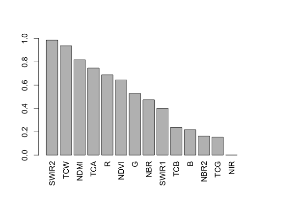
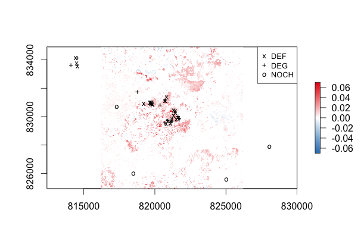

[](http://dx.doi.org/10.5281/zenodo.44611)

# Integrated Forest Monitoring using LTS and CBM

Data and R code accompanying the paper:

DeVries, B., Pratihast, A.K., Verbesselt, J., Kooistra, L. and Herold, M. 2016. Characterizing forest change using community-based monitoring data and Landsat time series. *PLOS ONE*, in press.

## Introduction

This paper presents an approach to integrate community-based monitoring (CBM) data with dense Landsat times series (LTS) to characterize subtle forest changes. Here, we focus on deforestation and degradation processes, but this approach can be used to measure and monitor a broader range of forest change variables.

This repository holds the local data and the R code used to carry out this study. Because of size restrictions, the LTS data are not included here (except for a time series for an example location). Landsat image data can be downloaded for free via the USGS.

## Community-Based Monitoring data

In this study, we worked with local forest rangers to demonstrate the potential of CBM data when integrated with LTS. A series of observations made by the rangers over a period of three years is included here. These observations were labelled as either deforestation ("DEF") or degradation ("DEG") events. We also included a set of no-change ("NOCH") observations based on visual interpretation of a random sample using high-resolution imagery to complete the training dataset.

```R
library(rgdal)
library(raster)
obs <- readOGR('data', 'local_observations')

plot(obs, col = 'white')
plot(subset(obs, label == "NOCH"), col = '#4daf4a', pch = '*', add = TRUE)
plot(subset(obs, label == "DEG"), col = '#377eb8', pch = '+', add = TRUE)
plot(subset(obs, label == "DEF"), col = '#e41a1c', pch = 'X', cex = 0.7, add = TRUE)
scalebar(25000, label = '25km')
legend('topright', legend = c('DEF', 'DEG', 'NOCH'), pch = c('X', '+', '*'), 
       pt.cex = c(0.7, 1, 1), col = c('#e41a1c', '#377eb8', '#4daf4a'), bty = 'n')
```

<div style="text-align:center">

</div>


## Spectral bands and indices

In this paper we used a range of indices in addition to the original six Landsat bands (excluding the thermal band). The original six bands are included here for an example observation (where deforestation ("DEF") was observed).

```R
LTS <- read.csv('data/LTS.csv')
head(LTS)
```

Each column represents a spectral band, and can be neatly visualized using the ```zoo``` package:

```R
library(zoo)
swir1 <- zoo(LTS$SWIR1, as.Date(LTS$date))
plot(swir1, type = 'b', pch = '*', cex = 0.65, xlab = 'Time')
```

<div style="text-align:center">

</div>

We computed a range of indices based on these spectral bands:

```R
LTS$NDVI <- (LTS$NIR - LTS$R) / (LTS$NIR + LTS$R)
LTS$NDMI <- (LTS$NIR - LTS$SWIR1) / (LTS$NIR + LTS$SWIR1)
LTS$NBR <- (LTS$NIR - LTS$SWIR2) / (LTS$NIR + LTS$SWIR2)
LTS$NBR2 <- (LTS$SWIR1 - LTS$SWIR2) / (LTS$SWIR1 + LTS$SWIR2)
```

For tasseled cap indices, we used a single set of coefficients, assuming that the atmospheric correction also corrected for sensor-dependent differences.

```R
brightness <- c(0.2043, 0.4158, 0.5524, 0.5741, 0.3124, 0.2303)
greenness <- c(-0.1603, -0.2819, -0.4934, 0.7940, -0.0002, -0.1446)
wetness <- c(0.0315, 0.2021, 0.3102, 0.1594, -0.6806, -0.6109)

LTS$TCB <- apply(LTS[, c(2:7)], 1, FUN=function(x) sum(x * brightness))
LTS$TCG <- apply(LTS[, c(2:7)], 1, FUN=function(x) sum(x * greenness))
LTS$TCW <- apply(LTS[, c(2:7)], 1, FUN=function(x) sum(x * wetness))
```

And finally, the tasseled cap angle (TCA) was computed as the angle between the TCB and TCG vectors.

```R
LTS$TCA <- atan(LTS$TCG / LTS$TCB)
```

## Random Forest covariates

We used several data reduction approaches to derive random forest covariates for *each* of spectral bands and indices (hereafter simply referred to as "bands"). The covariates used for the random forest models in this paper were based on two types of LTS reductions: (1) full time series descriptors; and (2) segment-based descriptors.

### (1) Full time series descriptors

We used the robust linear model (rlm) from the ```MASS``` R package to fit a linear model over the entire time series for each of the spectral bands. We first converted the irregularly sampled LTS to a regular "daily" time series, filling in missing observations with ```NA``` using the ```bfast``` package, as in this example using the ```TCW``` band.

```R
library(bfast)
bts <- bfastts(LTS$TCW, dates = as.Date(LTS$date), type = "irregular")
bpp <- bfastpp(bts, order = 1)
```

```bfastts``` produces a ```ts``` object, with a time index expressed as a numeric (ie. decimal year) and ```bfastpp``` produces a ```data.frame``` from this time series that we can use to easily produce fitted models.

```R
library(MASS)
m <- rlm(response ~ as.numeric(time), data = bpp)
rlmIntercept <- coef(m)[1] + coef(m)[2] * min(bpp$time)
rlmTrend <- coef(m)[2]
bpp$pred_rlm <- predict(m, newdata = bpp)

plot(zoo(bpp$response, bpp$time), type = 'b', pch = '*', cex = 0.65, ylab = "TCW", xlab = "Time")
lines(zoo(bpp$pred_rlm, bpp$time), col = 'red', lty = 2)
```

<div style="text-align:center">

</div>

### (2) Segment-based descriptors

The full time series descriptor may be a good measure of gradual changes over time, but as we can see in the plot above, it does not fully represent abrupt changes. For this reason, we used the BFAST method to derive temporal segments, and fit RLM models to each of these segements individuals. For simplicity (ie. to keep the total number of covariates manageble), we limited the segments to a maximum of one segment.

The function ```coefSegments()``` included in this repository can derive and plot these segments for a time sereis. This function is based on the ```breakpoints()``` function in the ```strucchange``` package. To limit to a binary output (ie. maximum 1 breakpoint), set ```breaks = 1```.

Here, we use the TCW time series as an example, but this was performed for all spectral bands.

```R
library(strucchange)
source('R/coefSegments.R')
segs <- coefSegments(LTS$TCW, dates = as.Date(LTS$date), model = 'rlm', breaks = 1, plot = TRUE, dataLabel = 'TCW')
print(segs)
```

<div style="text-align:center">

</div>

All the covaraties computed for all local observations are included here.

```R
covs <- read.csv('data/covariates.csv')
head(covs)
```

Note: the ```*_breakDate``` columns represent the time of a break from the *end* of the time series.

## Random Forest models

We used the ```randomForest``` package in R to derive random forest models using the training data shown above. Given the randomness of the method, exact results may differ between runs (hint: use ```set.seed()``` for reproduceable results).

```R
library(randomForest)
rf <- randomForest(covs[, -c(1:3)], covs$label, ntree = 7000, importance = TRUE)
rf$confus
```

The out-of-box (OOB) error rate is shown by printing the confusion matrix above.

## Estimating variable importance

When we set ```importance = TRUE``` above, several importance measures are recorded for each covariate based on the individual classification trees. However, given the random nature of the model, and the high correlation bewteen covariates, this is not an altogether trustworthy measure of variable importance. 

For this study, we derived a different measure of importance, focussing on the spectral bands themselves rather than the specific spectral-temporal covariate. In short, we derived random forest models for covariate grouped by spectral band, and ranked the models by their overall accuracy, as well as their accuracy per class. We repeated this process many times, and derived a score based on the "average" rank of each band. 

Note that this process can take quite a long time to run. The ```doMC``` package can help by running the iteration in parallel. Here, we run the iteration on 6 cores, but this can be adjusted according to your system. The results of the following code chunk are also included in this repository.

```R
library(doMC)
registerDoMC(cores = 6)

N <- 1000
band_names <- unique(substr(names(covs), 1, regexpr('_', names(covs)) - 1))[-c(1:2)]

res <- foreach(k = 1:N) %dopar% {
  
  rf <- vector('list', length(band_names))
  
  # run random forest for each band
  for(i in 1:length(band_names)) {
    patt <- paste('^', band_names[i], '_', sep = '')
    rfCovs <- covs[, grepl(patt, names(covs))]
    rf[[i]] <- randomForest(rfCovs, covs$label, ntree = 7000)
  }
  
  # get error rates for each band
  deferr <- sapply(rf, FUN=function(x) x$confus[1, 4])
  degerr <- sapply(rf, FUN=function(x) x$confus[2, 4])
  nocherr <- sapply(rf, FUN=function(x) x$confus[3, 4])
  allerr <- sapply(rf, FUN=function(x) 
    1 - sum(x$confus[1, 1], x$confus[2, 2], x$confus[3, 3]) / sum(x$confus[c(1:3), c(1:3)]))
  
  # rank by decreasing accuracy (increasing error)
  x_def <- sapply(band_names, FUN=function(x) which(x == band_names[order(deferr)]))
  x_deg <- sapply(band_names, FUN=function(x) which(x == band_names[order(degerr)]))
  x_noch <- sapply(band_names, FUN=function(x) which(x == band_names[order(nocherr)]))
  x_all <- sapply(band_names, FUN=function(x) which(x == band_names[order(allerr)]))
  
  # scores
  S_def <- (length(band_names) - x_def) / (length(band_names) - 1)
  S_deg <- (length(band_names) - x_deg) / (length(band_names) - 1)
  S_noch <- (length(band_names) - x_noch) / (length(band_names) - 1)
  S_all <- (length(band_names) - x_all) / (length(band_names) - 1)
  
  res <- as.data.frame(cbind(S_def, S_deg, S_noch, S_all))
  names(res) <- c('S_def', 'S_deg', 'S_noch', 'S_all')
  row.names(res) <- band_names
  
  res
}

# reduce list of data.frames by summing ranks and divide by N
S <- Reduce('+', res) / N
```

The results of the above code chunk are available in this repository.

```R
S <- read.csv('data/rf_band_scores.csv', row.names = 1)

bp <- barplot(S$S_all[rev(order(S$S_all))], ylim = c(0, 1))
text(x = bp + 0.5, y = -0.05, label = row.names(S)[rev(order(S$S_all))], xpd = TRUE, srt = 90, pos = 2)
```

<div style="text-align:center">

</div>

## Mapping forest change variables

We used the most important spectral-temporal variables to produce spatial predictions of deforestation, degradation or no-change for several sites across our study area. The covariate raster layers for one of these sites in the Tura sub-district are available at the following link: https://www.dropbox.com/s/6i9vbhnnrge8apw/tura_covariates.zip?dl=0

In a unix shell:

```bash
wget -P data/ https://www.dropbox.com/s/6i9vbhnnrge8apw/tura_covariates.zip?dl=0
unzip data/tura_covariates.zip -d data/
```

Now open the layers in R. You will see that only the RLM covariates of the green band, and all covaraites of the SWIR2 and TCW bands have been included to reduce computation time (ideally, we would like to have layers representing all covariates studied above).

```R
library(raster)
tura_covs <- brick('data/tura_covariates.grd')
names(tura_covs)
```

As an example, look at the change in amplitude between SWIR2 segments. This change could be a clue as to where and what types of changes may have occured over the time period we are studying.

```R
cols <- colorRampPalette(c('#377eb8', '#ffffff', '#e41a1c'))(255)
delAmp <- tura_covs$SWIR2_amp2 - tura_covs$SWIR2_amp1
plot(delAmp, zlim= c(-0.07, 0.07), col = cols)
plot(subset(obs, label == "NOCH"), pch = 'o', add = TRUE, cex = 0.8)
plot(subset(obs, label == "DEG"), pch = '+', add = TRUE, cex = 0.8)
plot(subset(obs, label == "DEF"), pch = 'x', add = TRUE, cex = 0.8)
legend('topright', legend = c('DEF', 'DEG', 'NOCH'), pch = c('x', '+', 'o'), cex = 0.8)
```

<div style="text-align:center">

</div>

Since we are now only using a subset of these spectral-temporal variables, we need to adjust the covariate ```data.frame``` and make another random forest model. Also, it's very important that the covariates are named exactly as in the raster layers (e.g. "TCW" and "tcWet" are used interchangeably).

```R
new_covs <- covs[, grepl("G_rlm|tcWet|SWIR2", names(covs))]
new_covs <- new_covs[, !grepl("del", names(new_covs))]
```

This study did not focus on the precise *timing* of changes, and as such, we changed the break date covariate into a binary (break/no-break) covariate.

```R
new_covs$SWIR2_breakDate <- factor(new_covs$SWIR2_breakDate == 9999, levels = c(FALSE, TRUE), labels = c(1, 0))
new_covs$tcWet_breakDate <- factor(new_covs$tcWet_breakDate == 9999, levels = c(FALSE, TRUE), labels = c(1, 0))
names(new_covs) <- gsub("breakDate", "break", names(new_covs))
```

Now the revised random forest model can be made. Recall that the training labels were left behind in the "covs" ```data.frame```.

```R
rf <- randomForest(new_covs, covs$label, ntrees = 5000)
rf$confus
```

Now we can run ```predict``` from the raster package. For this, we first define a helper function to carry out the spatial predictions.

```R
predfun <- function(model, data) {
  v <- predict(model, data, type = 'prob')
  as.vector(v)
}

predicted <- predict(tura_covs, rf, fun = predfun, index = 1:3)
names(predicted) <- c("DEF", "DEG", "NOCH")
```

These layers represent esimated class probabilities for "DEF", "DEG" and "NOCH". Some of these pixels represent areas that were non-forest before our period of interest (e.g. wetland areas in the north of this site). Since we don't have any training data related to forest gain or other non-forest processes, we need to exclude these pixels using a forest mask from the year 2001 (from the closest cloud-free image to 2000).

In this paper, we mapped DEF and DEG by displaying their probabilities only when those exceeded 50%.

```R
fm <- raster('data/forest_mask_2000.tif')
predicted[is.na(fm)] <- NA
def <- predicted[[1]]
def[def < 0.5] <- NA
deg <- predicted[[2]]
deg[deg < 0.5] <- NA

reds <- colorRampPalette(c("#ffffff", "#e41a1c"))(255)
blues <- colorRampPalette(c("#ffffff", "#377eb8"))(255)

plot(fm, col = '#4d9221', legend = FALSE)
plot(def, col = reds, zlim = c(0.5, 1), add = TRUE, legend = FALSE)
plot(deg, col = blues, zlim = c(0.5, 1), add = TRUE, legend = FALSE)

```

<div style="text-align:center">

</div>

## References

TODO...

